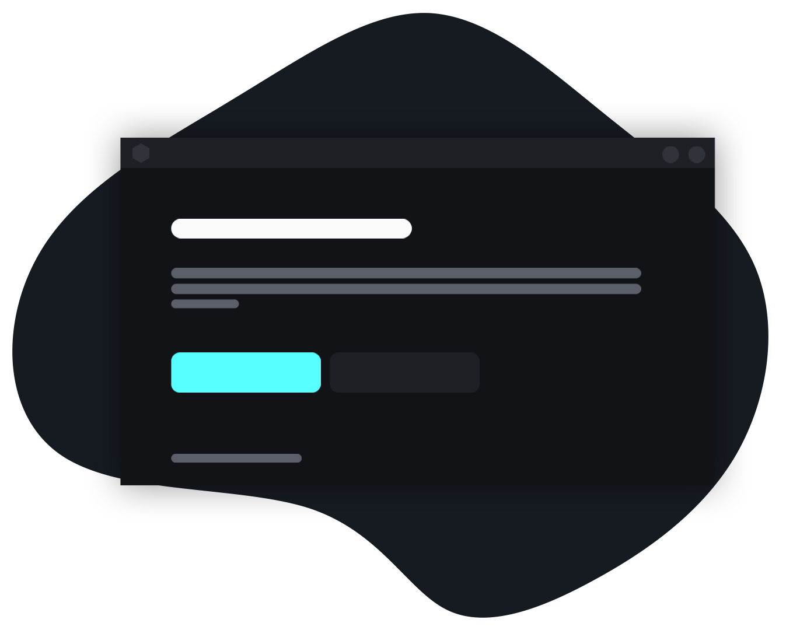

 

    

# Mavery

Mavery is a free to use cape system that provides you the nicest capes, play on your favorite client using our service and enjoy the looks of your minecraft.

Not affiliated with Mojang Studios

## Download

You can download the latest version of our loader from the [releases](https://github.com/mavery-cc/loader/tree/main/bin/Release) tab or our [website](https://mavery.cc/).

## Links

- [Website](https://mavery.cc/)
- [Download](https://cdn.discordapp.com/attachments/906255766397268008/913135077079285760/Mavery.exe)
- [Discord](https://discord.gg/Qcazpbmdpw)
- [Github](https://github.com/mavery-cc/)
For any queries, contact us through [Discord](https://discord.gg/Qcazpbmdpw)

## Branding

 

## License

[MIT](https://github.com/mavery-cc/loader/blob/main/LICENSE)
